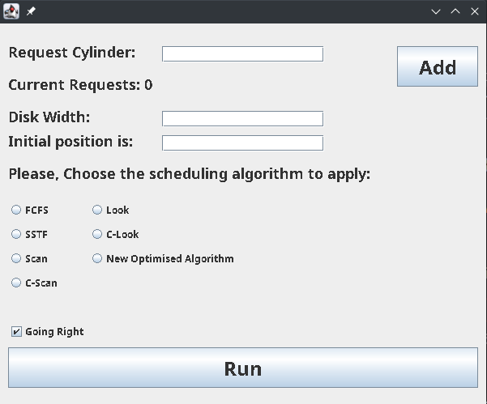
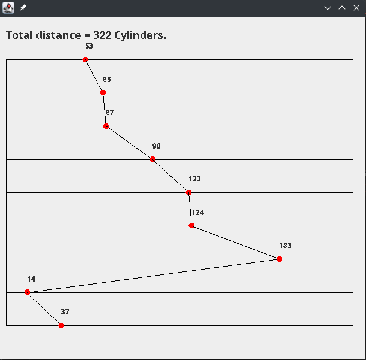

# Disk-Scheduling-Simulator
applying all the following disk scheduling
algorithms (FCFS, SSTF, SCAN, C-SCAN, LOOK and C-LOOK) as well as the newly optimized algorithm
by implementing their algorithms and applying it on a disk queue with requests for I/O blocks on cylinders.
Example of cylinders I/O requests:
98, 183, 37, 122, 14, 124, 65, 67
Initial head start cylinder: 53
The newly optimized algorithm procedure and flowchart are found in the
following paper:
https://research.ijcaonline.org/volume93/number18/pxc3896046.pdf

# Screenshots of the program Working:

